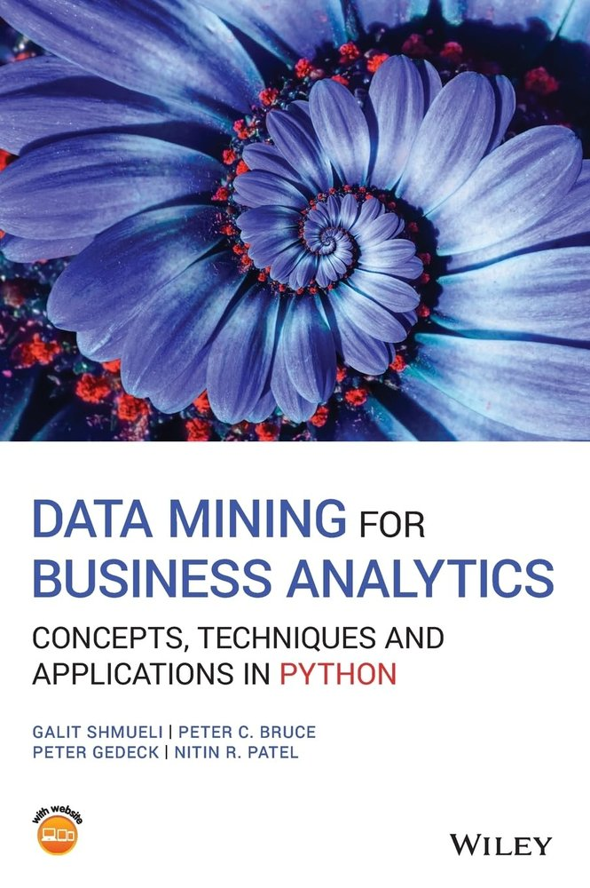

# Data Mining for Business Analytics

Notes from Galit Shmueli, Peter C. Bruce, Peter Gedeck, and Nitin R. Patel, *Data Mining for Business Analytics: Concepts, Techniques and Applications in Python*.

## Why This Book Matters

This book treats predictive modeling as a business decision workflow, not a catalog of algorithms. The durable takeaway is the discipline around the models: translate a business question into a specific mining task, partition data before fitting anything, benchmark every model against a naive rule, and judge performance on holdout data with metrics tied to the actual business action and its costs.

## Core Takeaways

- Data mining is statistics at scale and speed: classical statistics explains the population, data mining predicts the individual record (micro-decisioning).
- The process matters more than the algorithm: purpose, data, cleaning, partitioning, task definition, method choice, evaluation, deployment.
- Training data builds models, validation data selects among them, test data gives the honest final estimate. Skipping this invites overfitting.
- Model evaluation must match the business goal: error metrics for prediction, confusion matrix and cost-weighted cutoffs for classification, lift for ranking.
- Simple, interpretable models (linear and logistic regression, k-nearest neighbors) remain the workhorses; the differentiator is honest evaluation, not model complexity.

## Notes

- [Succinct study guide](succinct-summary.md)

## Interview Language

> I frame modeling work the way this book does: define the business decision first, partition the data before fitting, benchmark against a naive rule, and pick the simplest model that wins on validation data. For classification I care less about raw accuracy than about sensitivity, specificity, and the cutoff that minimizes expected misclassification cost for the decision at hand.

## Portfolio Signal

This note supports analytics and applied machine learning positioning because it emphasizes disciplined evaluation, cost-aware classification, and the end-to-end modeling workflow behind the case studies in the data-mining and notebooks repositories.
