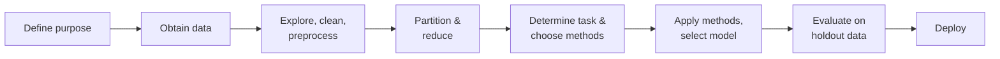

# Data Mining for Business Analytics — Succinct Study Guide

_Source: Galit Shmueli, Peter C. Bruce, Peter Gedeck & Nitin R. Patel, **Data Mining for Business Analytics: Concepts, Techniques and Applications in Python**._

## Core Thesis

Data mining is the exploration and analysis of large quantities of data to discover meaningful patterns and rules, sitting at the confluence of statistics and machine learning. The book's framing: data mining is statistics at scale, speed, and simplicity. Classical statistics describes and explains the population; data mining predicts the individual record.

The modeling process the book teaches:

---

## 1. Vocabulary and Framing

Business analytics (BA) is the practice of bringing quantitative data to bear on decision making. Business intelligence (BI) is the visualization and reporting side, answering "what happened" and "what is happening"; data mining is the predictive side.

Big data is characterized by the four Vs: volume, velocity, variety, and veracity (data created by organic, distributed processes is not subject to quality controls).

The same concepts carry different names across statistics and machine learning:

| Term used here | Synonyms |
| --- | --- |
| Predictor | Feature, input variable, attribute, field, independent variable |
| Outcome variable | Response, target, output variable, dependent variable |
| Record | Case, observation, row |
| Prediction | Estimation, scoring |
| Holdout data | Data not used in fitting, reserved to assess model performance |

Mindset difference worth internalizing:

| Statistics | Data Mining |
| --- | --- |
| Macro-decisioning | Micro-decisioning |
| Explain and describe population relationships | Predict values for new individual records |
| Small sample, few variables | Large sample, many variables |
| Best-fitting statistical model | Highest predictive power |
| Confidence intervals, hypothesis tests, p-values | Predictive metrics and misclassification costs |

---

## 2. Task Types

Supervised learning trains on records where the outcome is known, then predicts it for new records:

- **Prediction**: numerical outcome (linear regression, k-nearest neighbors, regression trees, neural networks, ensembles).
- **Classification**: categorical outcome (k-nearest neighbors, naive Bayes, classification trees, logistic regression, neural networks, discriminant analysis, ensembles).
- **Time-series forecasting**: regression-based and smoothing methods.

Unsupervised learning has no target variable:

- **Association rules**: what goes with what (market basket analysis, recommenders).
- **Clustering**: who goes with whom (segmentation).
- **Dimension reduction**: consolidating many variables into fewer.

Typical business questions: which customers are most likely to respond to an offer, commit fraud, default on a loan, or churn from a subscription.

---

## 3. The Data Mining Process

1. Develop an understanding of the project's purpose: one-shot question or ongoing application.
2. Obtain the dataset, often by sampling from a larger database or merging internal and external sources.
3. Explore, clean, and preprocess: verify consistency of definitions and units, handle missing values, check ranges and outliers.
4. Reduce the data if needed and partition into training, validation, and test sets.
5. Translate the business question into a specific data mining task (classification, prediction, clustering).
6. Choose the techniques to try.
7. Apply the algorithms, iterating on settings using validation performance.
8. Interpret results, pick the best model, and confirm it on the test set.
9. Deploy: integrate the model into operational systems and run it on real records to drive decisions.

SEMMA, the SAS variant, compresses this to Sample, Explore, Modify, Model, Assess.

Two practical notes: accurate models can often be built from a few hundred records, and the goal is rarely a static one-time answer; deployed models need APIs, compliant algorithms, and periodic re-evaluation.

---

## 4. Data Preparation

- **Variable types**: continuous, integer, categorical. Categorical variables are nominal (unordered, like region) or ordinal (ordered, like degree of creditworthiness). Ordinal variables can often be treated as continuous; nominal ones must be decomposed into binary dummies.
- **Dummy variables**: a categorical variable with m categories needs only m-1 dummies; the last is implied, and dropping it removes redundant information.
- **How much data**: rule of thumb is 10 records per predictor; Delmaster and Hancock suggest at least 6 × m × p records, where m is the number of outcome classes and p the number of predictors.
- **Outliers**: values far outside the rest of the data can distort procedures; what to do with them is a domain-knowledge decision, not an automatic one.
- **Missing values**: drop the records if few, impute mean or median to preserve the other variables, or drop the predictor entirely if it is expendable.
- **Normalization**: subtract the mean and divide by the standard deviation (z-score). Essential for distance-based methods so large-scale variables do not dominate.
- **Oversampling**: when the event of interest is rare (response, fraud), oversample it so the algorithm has enough cases to learn from, and train with asymmetric costs in mind.
- Watch for spurious relationships: more variables mean more chances to fit noise.

---

## 5. Partitioning and Overfitting

Overfitting means fitting the noise as well as the signal: a complex function that fits existing data perfectly but predicts new data poorly. The more variables included, the greater the risk. Defense is partitioning:

1. **Training partition** (largest): build the candidate models.
2. **Validation partition**: compare models and pick the best; feedback from validation tunes settings.
3. **Test partition** (optional holdout): honest final estimate for the chosen model, untouched during selection.
4. **New data**: score with the final model.

Training error is expected to be smaller than validation error because the model was fitted to the training set; in extreme overfitting, training error approaches zero while validation error grows.

---

## 6. Data Visualization

Visualization is a data mining step, not decoration: it finds errors, missing values, redundant variables, and needed transformations before modeling.

- **Basic charts**: bar charts (comparing a statistic across categories), line graphs, scatterplots. In supervised learning, focus on the outcome variable, typically on the y axis.
- **Distribution plots**: histograms and boxplots show the full distribution of a numerical variable; side-by-side boxplots compare subgroups and pair a numerical variable with a categorical one.
- **Heatmaps**: color-coded tables, useful for correlation matrices and for visualizing where missing values concentrate.
- **Beyond two variables**: hue, shape, and multiple panels encode categorical variables; color intensity and size encode numerical ones. A scatterplot matrix shows all variable pairs at once.
- **Manipulations**: rescaling uncrowds skewed data, jittering separates overlapping markers, and zooming, panning, and filtering support exploration from multiple views (trellis displays break charts down by group).

---

## 7. Evaluating Predictive Performance

Always evaluate on validation data, against a benchmark: the training-set average for prediction, the naive rule (classify everything as the majority class) for classification.

### Prediction (numerical outcome)

- **Average error**: signed, reveals systematic over- or under-prediction.
- **MAE (mean absolute error)**: average magnitude of errors.
- **MAPE (mean absolute percentage error)**: errors as a percentage of actuals.
- **RMSE (root mean squared error)**: like a standard deviation of errors, computed on validation data.

All are influenced by outliers. Compare training vs. validation error to diagnose overfitting.

### Classification (categorical outcome)

- **Confusion matrix**: correct and incorrect classifications by true and predicted class; yields the overall error rate and accuracy.
- **Propensity and cutoff**: classifiers output class probabilities; a cutoff (default 0.5) converts them to classes. Move the cutoff to maximize sensitivity, limit false positives, or minimize expected cost.
- **Sensitivity**: ability to correctly detect members of the important class.
- **Specificity**: ability to correctly rule out members of the other class.
- **ROC (receiver operating characteristic) curve**: plots the sensitivity-specificity trade-off as the cutoff sweeps from 0 to 1.
- **Misclassification costs**: when errors have unequal costs, evaluate expected per-record cost, not raw accuracy; oversample the rare class when it is the valuable one.

### Ranking

When the goal is finding the records most likely to be of interest rather than classifying everyone, use lift. A cumulative lift chart compares the model against the no-predictor baseline; a decile-wise lift chart reads directly as "mailing the top 10% scored by the model performs five times better than mailing at random."

---

## 8. Multiple Linear Regression

The model: Y = b0 + b1x1 + ... + bpxp + e, fitted by least squares. The same model serves two different goals, and the goal changes how you work:

| | Explanatory modeling | Predictive modeling |
| --- | --- | --- |
| Goal | Explain relationships between predictors and outcome | Predict the outcome for new records |
| Data use | Fit to all data | Fit on training, evaluate on validation |
| Judged by | R², residual analysis, p-values | Predictive accuracy on holdout data |
| Typical setting | Small sample, few variables | Large sample, many variables |

R² is biased toward the training set and grows with the number of predictors, so it is not a predictive-power metric.

### Subset Selection

Goal: a parsimonious model, the simplest that performs sufficiently well. Remove redundant predictors; choose candidates using domain knowledge first.

1. **Exhaustive search**: assess all subsets; look for high adjusted R² and Mallow's Cp close to the number of predictors.
2. **Forward selection**: start empty, add predictors one at a time, stop when additions stop being significant.
3. **Backward elimination**: start with everything, drop the least useful one at a time.
4. **Stepwise regression**: forward selection that also reconsiders dropping predictors at each step.

These find good candidates, not the best model; run them and compare on validation data, preferring the smaller model when performance is comparable.

---

## 9. k-Nearest Neighbors (k-NN)

A non-parametric, data-driven method: no assumed functional form and no fitted parameters. To classify a new record, find the k most similar training records (Euclidean distance is the most popular measure) and take a majority vote; for a numerical outcome, average the neighbors' values.

Choosing k:

- **Low k** (1, 3, ...) captures local structure but also noise and outliers.
- **High k** smooths out noise but can miss local structure; k = n collapses to the naive rule.
- Choose k empirically by validation error; typical range is 1 to 20, odd values avoid ties, and when two values tie, prefer the lower k to preserve local structure.
- The 1-NN classifier is surprisingly strong: its error rate is known to be at most roughly twice the best achievable error when training data is plentiful.

Practical notes:

- Normalize predictors first, or large-scale variables dominate the distance.
- Voting can be weighted by inverse distance so closer neighbors count more.
- A cutoff on the neighbor vote share converts k-NN votes into propensity-style classification.

Strengths: simplicity, no parametric assumptions, works well with large training sets. Weaknesses: it is a lazy learner (all computation happens at prediction time, which is slow on large sets) and it suffers the curse of dimensionality: the number of records needed to qualify as "large" grows exponentially with the number of predictors.

---

## 10. Logistic Regression

Extends the regression idea to a categorical (usually binary) outcome coded 0/1. Predictors can be continuous, categorical (as dummies), or mixed. The output is a propensity: the probability of belonging to class 1.

The model in three steps:

1. **Logistic response function** maps a linear function of predictors to a probability between 0 and 1 (the S-shaped sigmoid, not a straight line).
2. **Odds** = p / (1 - p) re-express the probability.
3. **Logit** = log(odds) is modeled as a linear function of the predictors, then mapped back to a probability and finally to a class via a cutoff.

Fitting uses maximum likelihood rather than least squares, so there are no residuals or R² in the linear-regression sense:

| | Linear regression | Logistic regression |
| --- | --- | --- |
| Problem | Prediction (numerical) | Classification (categorical) |
| Output | Continuous | Discrete class via propensity |
| Fitted shape | Best-fit line | Sigmoid curve |
| Loss | Mean squared error | Maximum likelihood |

Usage notes:

- Same dual use as linear regression: profiling (interpret coefficients, judge fit) vs. classifying (judge holdout performance).
- With large samples, p-values lose meaning; look at coefficient magnitudes and holdout performance instead.
- Multicollinearity still applies: remove extreme redundancies through subset selection or principal components analysis (PCA).
- Tune the cutoff with lift and decile charts to maximize sensitivity, limit false positives, or minimize expected cost.

---

## 11. Discriminant Analysis

A model-based classifier used for both classification and profiling. Linear discriminant analysis (LDA) constructs a new axis that maximizes separability among the classes by simultaneously:

1. Maximizing the distance between class means (each class summarized by its centroid, the center of the class).
2. Minimizing the within-class variation (scatter).

Distance from a record to a centroid can be Euclidean (straight-line) or statistical distance, which accounts for the covariance structure of the predictors (via the covariance matrix S) and generally works better when predictors are correlated.

---

## 12. Association Rules

Unsupervised learning over transaction data: market basket or affinity analysis, the study of what goes with what. Origin is point-of-sale data where each record lists all items in one transaction.

Method:

1. Generate if-then rules between items.
2. Use the Apriori algorithm to build frequent itemsets (single items, pairs, and larger sets) efficiently.
3. Keep only rules likely to indicate true dependence rather than coincidence.

Business uses: cross-promotions (discount one item, reprice the associated one), store placement, stocking decisions, and recommender systems. Collaborative filtering, used by the large recommenders, is a related but distinct technique: it personalizes per user rather than producing global item rules.

---

## 13. Durable Lessons

- Define the business decision before touching an algorithm; most analysis errors trace back to skipping this.
- Partition first, benchmark always: no model earns trust without beating the naive rule on data it never saw.
- Metrics must match the action: accuracy for balanced problems, sensitivity/specificity and cost-weighted cutoffs for asymmetric ones, lift for targeting.
- Prefer the parsimonious model; complexity is a cost, and R² on training data is not evidence of predictive power.
- Personalization is the shift data mining brought over classical statistics: from describing populations to scoring individual records for individual decisions.
