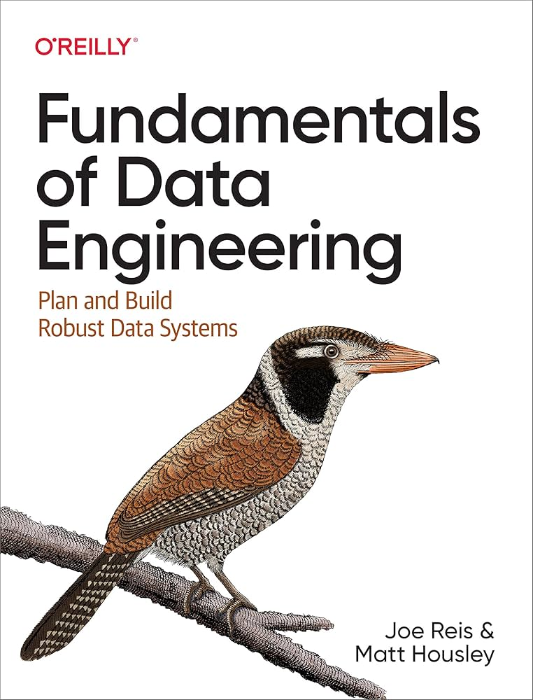

# Fundamentals of Data Engineering

Notes from Joe Reis and Matt Housley, *Fundamentals of Data Engineering: Plan and Build Robust Data Systems*.

## Why This Book Matters

This book is useful because it frames data engineering as a lifecycle discipline instead of a tool list. The durable takeaway is that data engineers design and operate systems that move data from source generation through storage, ingestion, transformation, and serving, while managing cross-cutting concerns like security, governance, observability, orchestration, architecture, and software engineering practice.

## Core Takeaways

- Data engineering is about reliable data systems, not tool collection.
- The data engineering lifecycle is a strong way to explain the full scope of the role.
- Source systems, storage design, ingestion strategy, transformation logic, and serving patterns are connected decisions.
- DataOps, observability, security, privacy, governance, and cost control are architecture concerns, not afterthoughts.
- Strong data engineers make pragmatic trade-offs across business value, maintainability, scalability, reliability, and cost.

## Notes

- [Succinct study guide](succinct-summary.md)

## Interview Language

> I think about data engineering through the full lifecycle: how data is generated, stored, ingested, transformed, and served. The hard part is not only moving data, but making the system reliable, secure, observable, governed, cost-aware, and useful for downstream analytics, ML, and operational use cases.

## Portfolio Signal

This note supports senior/staff data engineering positioning because it emphasizes architecture, lifecycle ownership, platform trade-offs, DataOps, governance, and business-facing data products.
