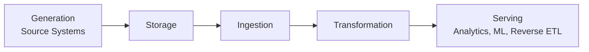

# Fundamentals of Data Engineering — Succinct Study Guide

_Source: Joe Reis & Matt Housley, **Fundamentals of Data Engineering: Plan and Build Robust Data Systems**._

## Core Thesis

Data engineering is not primarily about a specific tool, platform, or vendor. It is the discipline of designing, building, operating, and improving systems that turn raw data into trustworthy, usable data products for analytics, machine learning, reverse ETL, operations, and applications.

The book’s central framework is the **data engineering lifecycle**:

Across every lifecycle stage run the major **undercurrents**:

- **Security and privacy**
- **Data management**: governance, quality, lineage, cataloging, metadata, master/reference data
- **DataOps**: automation, testing, observability, CI/CD, reliability, incident response
- **Data architecture**: durable patterns, trade-offs, interoperability, scalability
- **Orchestration**: dependency management, scheduling, retries, SLAs
- **Software engineering**: code quality, version control, testing, modularity, deployment discipline

---

## 1. What Data Engineering Is

A data engineer builds and maintains systems that move data from source systems into forms that downstream users can trust and use.

Data engineers sit upstream of analysts, analytics engineers, data scientists, ML engineers, business users, and operational systems. Their work makes data accessible, reliable, timely, secure, and fit for purpose.

Key responsibilities:

- Understand how data is generated, stored, ingested, transformed, and served.
- Build pipelines and platforms that are reliable, scalable, observable, and maintainable.
- Balance cost, agility, scalability, simplicity, interoperability, reuse, and performance.
- Work with both technical stakeholders and business stakeholders.
- Avoid chasing hype; choose technologies based on business value and lifecycle fit.

A mature data engineer is not just a pipeline builder. They are a lifecycle owner, architecture thinker, platform operator, and business partner.

---

## 2. Data Maturity

Companies evolve through rough stages of data maturity:

### Starting with Data

The company has scattered data, ad hoc reporting, limited governance, and unclear ownership. The data engineer often acts as a generalist.

Priorities:

- Get stakeholder buy-in.
- Identify high-value data sources.
- Build a usable foundation.
- Produce quick wins without creating unmanageable technical debt.

### Scaling with Data

The company has formal data needs, growing pipelines, and more users. The data team begins to specialize.

Priorities:

- Standardize practices.
- Build scalable architecture.
- Introduce DataOps, testing, orchestration, monitoring, and governance.
- Support analytics and ML use cases without over-engineering.

### Leading with Data

The company treats data as a strategic asset and product capability.

Priorities:

- Enable self-service.
- Automate onboarding of new sources.
- Invest in catalogs, lineage, metadata, quality, governance, and platform reliability.
- Build differentiated internal data products and workflows.

---

## 3. Good Data Architecture

Data architecture is the design of systems that support data needs across the organization. Good architecture is not about copying trendy patterns; it is about choosing structures that fit business goals, team capabilities, risk, scale, and cost.

Principles of good data architecture:

1. **Choose common components wisely**: prefer proven, interoperable building blocks.
2. **Plan for failure**: assume systems, networks, vendors, jobs, and people will fail.
3. **Architect for scalability**: consider growth in data volume, velocity, users, and use cases.
4. **Architecture is leadership**: architecture choices shape team behavior and business capability.
5. **Always be architecting**: architecture evolves continuously.
6. **Build loosely coupled systems**: reduce brittle dependencies.
7. **Make reversible decisions**: avoid locking the organization into hard-to-change choices.
8. **Prioritize security**: security belongs in the design, not as a late add-on.
9. **Embrace FinOps**: cost is an architectural dimension.

Major architecture patterns discussed:

- **Data warehouse**: structured analytical store optimized for reporting and BI.
- **Data lake**: flexible storage for raw and varied data, often object-storage based.
- **Lakehouse**: combines lake flexibility with warehouse-like governance, tables, and performance.
- **Modern data stack**: modular cloud-first tools for ingestion, transformation, BI, observability, and orchestration.
- **Lambda architecture**: separate batch and streaming paths.
- **Kappa architecture**: streaming-first architecture using replayable logs.
- **Dataflow/unified batch and streaming**: treats bounded and unbounded data with shared concepts.
- **IoT architecture**: handles device telemetry, edge constraints, and high-volume events.
- **Data mesh**: domain-oriented ownership, data as a product, self-serve infrastructure, and federated governance.

---

## 4. Choosing Technologies

Technology selection should be driven by business value, lifecycle fit, team capacity, and total cost—not vendor hype or benchmark marketing.

Evaluation criteria:

- **Team size and capabilities**: do you have the people to operate the tool?
- **Speed to market**: does it solve today’s problem quickly enough?
- **Interoperability**: does it integrate cleanly with the broader stack?
- **Cost and value**: include infrastructure, people, maintenance, opportunity cost, and vendor risk.
- **Present vs. future needs**: avoid solving hypothetical scale problems too early.
- **Build vs. buy**: build only where it creates real competitive advantage.
- **Open source vs. proprietary**: weigh flexibility, support, governance, lock-in, and operational burden.
- **Monolith vs. modular**: modular systems offer flexibility but can create integration complexity.
- **Serverless vs. servers**: serverless reduces ops burden but may limit control or create cost surprises.
- **Benchmark skepticism**: benchmarks often do not reflect your actual workload, team, or cost model.

The book repeatedly argues for pragmatic simplicity: use managed, reliable, boring tools unless there is a clear reason not to.

---

# The Data Engineering Lifecycle in Depth

## 5. Generation: Source Systems

Source systems are where data originates. Data engineers must understand source behavior because upstream design shapes downstream reliability.

Common sources:

- Files and unstructured data
- APIs
- Application databases / OLTP systems
- OLAP systems
- Change data capture
- Logs
- CRUD systems
- Insert-only systems
- Message queues and event streams
- Third-party data
- Data shares

Important source-system concepts:

- **Data shape**: structured, semi-structured, unstructured
- **Data state**: mutable records vs. immutable events
- **Change patterns**: inserts, updates, deletes, CDC, logs
- **Time**: event time, processing time, ingestion time
- **Operational impact**: avoid harming production systems while extracting data
- **Contracts**: define expectations around schema, semantics, SLAs, and ownership

Source-system work requires collaboration with application engineers, product teams, DBAs, security, vendors, and business owners.

---

## 6. Storage

Storage is not just “where data lives.” It determines performance, durability, access patterns, cost, governance, and how easily data can be transformed or served.

Foundational storage concepts:

- Disk, SSD, RAM, CPU, and networking all affect performance.
- Serialization and compression affect size, speed, cost, and compatibility.
- Caching improves speed but introduces consistency considerations.
- Distributed storage improves scale and availability but adds complexity.

Storage systems and abstractions:

- **File storage**
- **Block storage**
- **Object storage**
- **Cache and memory-based storage**
- **Streaming storage**
- **Indexes, partitions, and clustering**
- **Data warehouses**
- **Data lakes**
- **Lakehouses**
- **Data platforms**

Important trade-offs:

- Single-machine vs. distributed systems
- Strong vs. eventual consistency
- Separation of compute and storage
- Schema-on-write vs. schema-on-read
- Single-tenant vs. multitenant storage
- Hot vs. cold storage
- Retention, archival, and deletion policies

Good storage design considers lifecycle management: how data arrives, evolves, is queried, is retained, and is eventually deleted.

---

## 7. Ingestion

Ingestion moves data from source systems into storage or processing systems.

Key ingestion dimensions:

- **Bounded vs. unbounded data**: finite batches vs. continuous streams.
- **Batch vs. streaming**: scheduled loads vs. continuous/event-driven ingestion.
- **Sync vs. async**: immediate response vs. decoupled delivery.
- **Push vs. pull vs. polling**: who initiates data transfer.
- **Throughput and scalability**: volume, concurrency, and growth.
- **Reliability and durability**: retry behavior, fault tolerance, idempotency.
- **Payload design**: size, format, metadata, compression.
- **Schema evolution**: handling changing fields and contracts.
- **Late-arriving data**: correcting results when data arrives after expected windows.
- **Ordering and delivery guarantees**: at-most-once, at-least-once, exactly-once semantics.
- **Replay**: ability to reprocess historical messages or files.
- **Dead-letter queues**: isolating bad messages for later inspection.

Common ingestion methods:

- Direct database connections
- Change data capture
- APIs
- Message queues and event streaming platforms
- Managed connectors
- Object storage drops
- EDI
- Database/file exports
- Shell scripts
- SSH, SFTP, SCP
- Webhooks
- Web interfaces
- Web scraping
- Transfer appliances
- Data sharing

The central warning: ingestion is deceptively hard. Correctness, contracts, schema drift, retries, partial failures, duplicate data, and operational impact matter as much as raw movement.

---

## 8. Queries, Modeling, and Transformation

Transformation turns raw data into usable, modeled, trusted information.

### Queries

A query passes through parsing, planning, optimization, execution, and result return. Query performance depends on storage layout, indexes, partitioning, clustering, statistics, joins, filters, resource allocation, and engine behavior.

Streaming queries add complexity because data is continuous, time-sensitive, and often out of order.

### Modeling

Data modeling gives structure and meaning to data.

Levels of modeling:

- **Conceptual**: business entities and relationships.
- **Logical**: tables, fields, relationships, constraints.
- **Physical**: implementation-specific design for a database or engine.

Modeling approaches include:

- Normalization
- Dimensional modeling
- Fact and dimension tables
- Slowly changing dimensions
- Wide denormalized tables
- Data Vault
- One Big Table patterns
- Streaming/event models

Good models are understandable, consistent, maintainable, and aligned with business semantics.

### Transformation

Transformation can happen through:

- Batch jobs
- SQL transformations
- ELT in the warehouse/lakehouse
- Materialized views
- Query federation / virtualization
- Streaming transformations
- Distributed processing frameworks

The goal is not transformation for its own sake. The goal is to create data products that are accurate, explainable, reusable, and useful.

---

## 9. Serving Data

Serving is the final lifecycle stage: making data available for actual use.

Primary serving use cases:

- Business analytics
- Operational analytics
- Embedded analytics
- Machine learning
- Reverse ETL
- Data applications
- Data products

General considerations:

- **Trust**: users must believe the data is correct.
- **Use case and user**: design for how the data will be consumed.
- **Definitions and logic**: shared metrics and semantic consistency matter.
- **Self-service**: useful only when data is discoverable, documented, governed, and reliable.
- **Data products**: treat datasets like maintained products with owners, users, quality expectations, and lifecycle management.

Serving patterns:

- File exchange
- Databases
- Streaming systems
- Query federation
- Data sharing
- Semantic layers
- Metrics layers
- Notebooks
- Reverse ETL to operational systems

For ML, data engineers should understand feature engineering, training/serving skew, reproducibility, model inputs, data versioning, and feedback loops, even if they do not build the models themselves.

---

# Security, Privacy, and Future Direction

## 10. Security and Privacy

Security is a habit, not a checklist. Data engineers handle valuable, sensitive, and regulated data, so they must assume risk exists across people, processes, and technology.

Security principles:

- Practice “negative thinking”: assume things can go wrong.
- Apply least privilege.
- Understand shared responsibility in the cloud.
- Back up data.
- Patch and update systems.
- Encrypt data in transit and at rest.
- Log, monitor, and alert.
- Control network access.
- Secure low-level data engineering systems such as credentials, files, jobs, buckets, queues, databases, and pipelines.

Privacy must be designed into data systems. Reckless handling of personal data can create ethical, legal, financial, and reputational damage.

---

## 11. Future of Data Engineering

The lifecycle will remain durable even as tools change.

Likely trends:

- Less operational complexity through managed platforms and easier tooling.
- More interoperability across cloud-scale data systems.
- More “enterprisey” practices returning: governance, quality, lineage, privacy, compliance, metadata, and cost control.
- Role boundaries will continue to shift between data engineers, analytics engineers, ML engineers, software engineers, and platform engineers.
- Movement from the modern data stack toward a more live, event-driven, application-integrated data stack.
- More streaming pipelines and real-time analytical databases.
- Tighter feedback loops between applications, ML, and data platforms.
- Continued importance of spreadsheets and “dark matter data” that lives outside formal systems.

The durable skill is not memorizing tools. The durable skill is understanding trade-offs across the lifecycle.

---

## Appendices: Technical Foundations

### Serialization and Compression

Data engineers should understand file formats, encoding, compression ratios, CPU trade-offs, splittability, schema support, and interoperability. These choices affect performance, storage cost, and downstream compatibility.

### Cloud Networking

Cloud networking matters because data systems are increasingly distributed across services, regions, clouds, and networks. Data engineers should understand basic networking concepts, routing, security boundaries, private connectivity, ingress/egress costs, and latency.

---

# Practical Mental Model

When designing or evaluating a data system, ask:

1. **What business outcome or user need does this support?**
2. **Where is the data generated, and who owns it?**
3. **How is the data stored, retained, secured, and governed?**
4. **How is the data ingested, and what failure modes exist?**
5. **How is the data transformed into trusted information?**
6. **Who consumes it, and in what form?**
7. **What are the SLAs, quality checks, lineage, observability, and incident processes?**
8. **What are the cost, scalability, lock-in, and maintenance trade-offs?**
9. **Can the architecture evolve without a painful rewrite?**
10. **Does the system make data easier to trust, understand, and use?**

---

## One-Sentence Summary

Data engineering is the lifecycle discipline of turning raw, messy, operational data into secure, reliable, governed, and useful data products by making pragmatic architecture, technology, and operational trade-offs.
